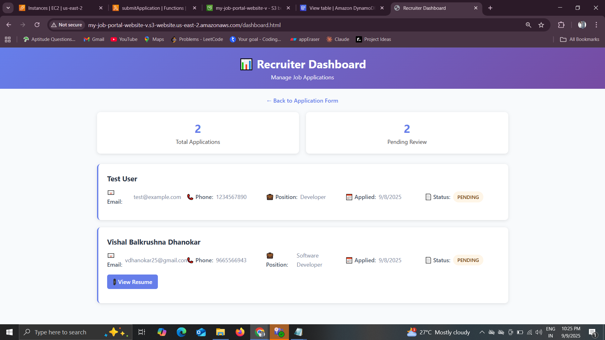

# HireHub-Serverless-Job-Portal


🚀 **HireHub** is a fully serverless job application portal where candidates can apply for jobs and recruiters can review applications via a secure dashboard.  
It’s built using **AWS Lambda, API Gateway, DynamoDB, and S3**, making it scalable and cost-effective.

---

## ✨ Features
- 📝 Job application form with resume upload
- 🗄️ Applications stored in DynamoDB
- 📂 Resumes stored securely in Amazon S3
- 📊 Recruiter dashboard to view submissions
- 🌐 Fully serverless architecture (no servers to manage)
- 🔐 Secure access with IAM permissions

---

## 🛠️ Tech Stack
- **Frontend**: HTML, CSS, JavaScript
- **Backend**: Node.js 22 (AWS SDK v3)
- **Database**: Amazon DynamoDB
- **Storage**: Amazon S3
- **API Management**: Amazon API Gateway
- **Compute**: AWS Lambda

---

## 📂 Project Structure
```

HireHub-Serverless-Job-Portal/
│── frontend/
│   ├── index.html          # Candidate job application form
│   ├── dashboard.html      # Recruiter dashboard
│
│── lambda/
│   ├── submitApplication/
│   │   ├── index.js
│   │   ├── package.json
│   ├── getApplications/
│       ├── index.js
│       ├── package.json
│
│── README.md

```

---

## 🚀 How to Deploy

Follow these **simple steps** to set up the project in AWS:

### 1. Create S3 Buckets
- One bucket for **frontend website hosting** (make public).
- One bucket for **resume storage** (keep private).

### 2. Create DynamoDB Table
- Table name: `JobApplications`
- Partition key: `applicationId` (String)

### 3. Create IAM Role
- Create a role for Lambda with permissions:
  - `AWSLambdaBasicExecutionRole`
  - DynamoDB: `PutItem`, `Scan`
  - S3: `PutObject`, `GetObject`, `DeleteObject` (only on resume bucket)

### 4. Deploy Lambda Functions
- **submitApplication** → Handles form submission & resume upload.
- **getApplications** → Fetches applications for recruiter dashboard.
- Set environment variables in Lambda:
  - `RESUME_BUCKET = <your-resume-bucket>`
  - `TABLE_NAME = JobApplications`

### 5. Create API Gateway
- Create a REST API.
- Resource: `/applications`
- Methods:
  - `POST` → `submitApplication`
  - `GET` → `getApplications`
- Enable CORS.
- Deploy API (stage name: `prod`).

### 6. Upload Frontend
- Edit `frontend/index.html` and `dashboard.html` → replace `API_BASE_URL` with your API Gateway endpoint.
- Upload these files to your **website hosting S3 bucket**.
- Enable static website hosting in the bucket.

---

## ✅ Testing
1. Open your website URL from the **website S3 bucket**.  
2. Submit an application with a sample PDF resume.  
3. Open the **Recruiter Dashboard** (`dashboard.html`) to see the application.  
4. Click **View Resume** to verify the resume file.  

---

## 📸 Screenshots
### Application Form


### Recruiter Dashboard


---

## 👨‍💻 Author
**Vishal Dhanokar**  
Serverless Developer | AWS & Cloud Enthusiast  

